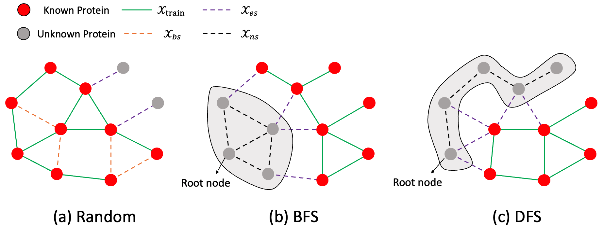
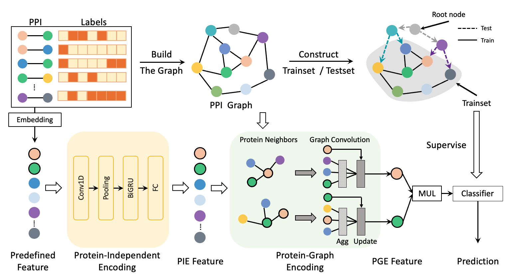
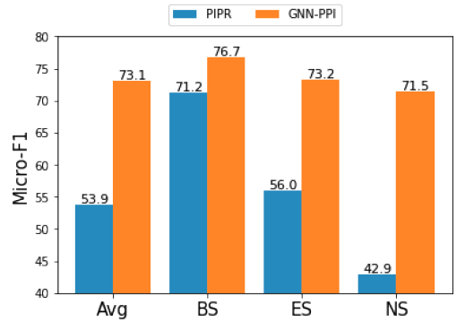
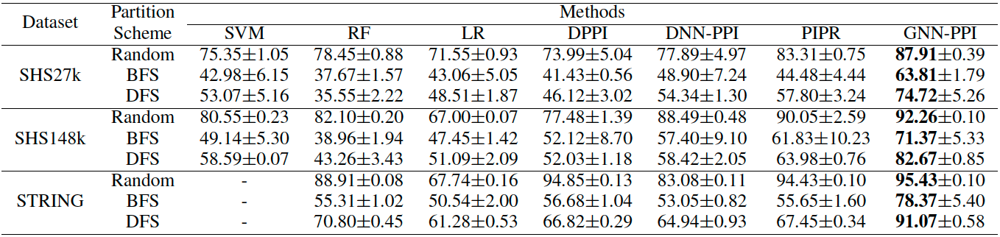
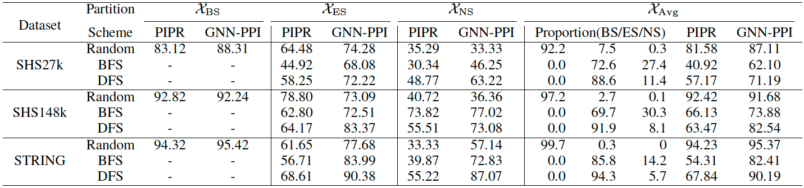
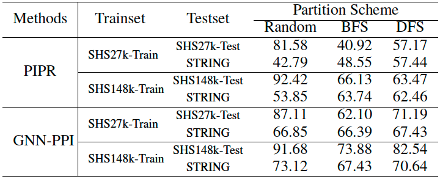
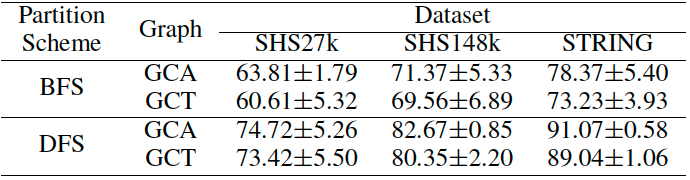

# GNN_PPI


Codes and models for the paper "Learning Unknown from Correlations: Graph Neural Network for Inter-novel-protein Interaction Prediction".

> [Learning Unknown from Correlations: Graph Neural Network for Inter-novel-protein Interaction Prediction](https://arxiv.org/abs/2105.06709) \
> Authors: Guofeng Lv, Zhiqiang Hu, Yanguang Bi, Shaoting Zhang \
> Arxiv extended verison (arxiv: https://arxiv.org/abs/2105.06709)

Contact: lvguofeng@sensetime.com. Any questions or discussions are welcomed!

## Abstract

The study of multi-type Protein-Protein Interaction (PPI) is fundamental for understanding biological processes from a systematic perspective and revealing disease mechanisms. Existing methods suffer from significant performance degradation when tested in unseen dataset. In this paper, we investigate the problem and find that it is mainly attributed to the poor performance for inter-novel-protein interaction prediction. However, current evaluations overlook the inter-novel-protein interactions, and thus fail to give an instructive assessment. As a result, we propose to address the problem from both the evaluation and the methodology. Firstly, we design a new evaluation framework that fully respects the inter-novel-protein interactions and gives consistent assessment across datasets. Secondly, we argue that correlations between proteins must provide useful information for analysis of novel proteins, and based on this, we propose a graph neural network based method (GNN-PPI) for better inter-novel-protein interaction prediction. Experimental results on real-world datasets of different scales demonstrate that GNN-PPI significantly outperforms state-of-the-art PPI prediction methods, especially for the inter-novel-protein interaction prediction.

## Contribution

1. We design a new evaluation framework that fully respects the inter-novel-protein interactions and give consistent assessment across datasets. 
    <div align="center"></div>
    <center>An example of the testset construction strategies under the new evaluation framework. Random is the current scheme, while Breath-First Search (BFS) and Depth-First Search (DFS) are the proposed schemes.</center>

2. We propose to incorporate correlation between proteins into the PPI prediction problem. A graph neural network based method is presented to model the correlations.
    <div align="center"></div>
    <center>Development and evaluation of the GNN-PPI framework. Pairwise interaction data are firstly assembled to build the graph, where proteins serve as the nodes and interactions as the edges. The testset is constructed by firstly selecting the root node and then performing the proposed BFS or DFS strategy. The model is developed by firstly performing embedding for each protein to obtain predefined features, then processed by Convolution, Pooling, BiGRU and FC modules to extract protein-independent encoding (PIE) features, which are finally aggregated by graph convolutions and arrive at protein-graph encoding (PGE) features.  Features of the pair proteins in interaction are multiplied and classified, supervised by the trainset labels.</center>

3. The proposed GNN-PPI model achieves state-of-the-art performance in real datasets of different scales, especially for the inter-novel-protein interaction prediction.
    <div align="center"></div>
    <center>For further investigation, we divide the testset into BS, ES and NS subsets, where BS denotes Both of the pair proteins in interaction were Seen during training, ES denotes Either (but not both) of the pair proteins was Seen, and NS denotes Neither proteins were Seen during training. We regard ES and NS as inter-novel-protein interactions. Existing methods suffer from significant performance degradation when tested on unseen Protein-protein interaction, especially inter-novel-protein interactions. On the contrary, GNN-PPI can handle this situation well, whether it is BS, ES or NS, the performance will not be greatly reduced.</center>

## Experimental Results


> We evaluate the multi-label PPI prediction performance using micro-F1. This is because micro-averaging will emphasize the common labels in the dataset, which gives each sample the same importance.

### Benchmark
- Performance of GNN-PPI against comparative methods over different datasets and data partition schemes. 
<div align="center"></div>

### In-depth Analysis
- In-depth analysis between PIPR and GNN-PPI over BS, ES and NS subsets.
<div align="center"></div>

### Model Generalization
- Testing on trainset-homologous testset vs. unseen testset, under different evaluations.
 <div align="center"></div>

### PPI Network Graph Construction
- The impact of the PPI network graph construction method.
 <div align="center"></div>

## Using GNN_PPI

This repository contains:
- Environment Setup
- Data Processing
- Training
- Testing
- Inference

### Environment Setup

> base environment: python 3.7, cuda 10.2, pytorch 1.6, torchvision 0.7.0, tensorboardX 2.1 \
pytorch-geometric: \
pip install torch-scatter -f https://pytorch-geometric.com/whl/torch-1.6.0+cu102.html \
pip install torch-sparse -f https://pytorch-geometric.com/whl/torch-1.6.0+cu102.html \
pip install torch-cluster -f https://pytorch-geometric.com/whl/torch-1.6.0+cu102.html \
pip install torch-spline-conv -f https://pytorch-geometric.com/whl/torch-1.6.0+cu102.html \
pip install torch-geometric 

### Data Processing

The data processing codes in gnn_data.py (Class GNN_DATA), including:
- data reading (**def** \_\_init\_\_)
- protein vectorize (**def** get_feature_origin)
- generate pyg data (**def** generate_data)
- Data partition (**def** split_dataset)

### Training

Training codes in gnn_train.py, and the run script in run.py.

```   
"python -u gnn_train.py \
    --description={} \              # Description of the current training task
    --ppi_path={} \                 # ppi dataset
    --pseq_path={} \                # protein sequence
    --vec_path={} \                 # protein pretrained-embedding
    --split_new={} \                # whether to generate a new data partition, or use the previous
    --split_mode={} \               # data split mode
    --train_valid_index_path={} \   # Data partition json file path
    --use_lr_scheduler={} \         # whether to use training learning rate scheduler
    --save_path={} \                # save model, config and results dir path
    --graph_only_train={} \         # PPI network graph construction method, True: GCT, False: GCA
    --batch_size={} \               # Batch size
    --epochs={} \                   # Train epochs
    ".format(description, ppi_path, pseq_path, vec_path, 
            split_new, split_mode, train_valid_index_path,
            use_lr_scheduler, save_path, graph_only_train, 
            batch_size, epochs)
```

#### Dataset Download:

STRING(we use Homo sapiens subset): 
- PPI: https://stringdb-static.org/download/protein.actions.v11.0/9606.protein.actions.v11.0.txt.gz 
- Protein sequence: https://stringdb-static.org/download/protein.sequences.v11.0/9606.protein.sequences.v11.0.fa.gz 

SHS27k and SHS148k: 
- http://yellowstone.cs.ucla.edu/~muhao/pipr/SHS_ppi_beta.zip

This repositorie uses the processed dataset download path:
- https://pan.baidu.com/s/1FU-Ij3LxyP9dOHZxO3Aclw (Extraction code: tibn)

### Testing

Testing codes in gnn_test.py and gnn_test_bigger.py, and the run script in run_test.py and run_test_bigger.py.

gnn_test.py: It can test the overall performance, and can also make in-depth analysis to test the performance of different test data separately. \
gnn_test_bigger.py: It can test the performance between the trainset-homologous testset and the unseen testset. \
Running script run_test_bigger.py as above.

### Inference

If you have your own dataset or want to save the prediction results, you can use inference.py. After execution, a ppi csv file will be generated to record the predicted PPI type of each pair of interacting proteins.

Running script run_inference.py as above.

## Citation

If you find this project useful for your research, please use the following BibTeX entry.

    @misc{lv2021learning,
        title={Learning Unknown from Correlations: Graph Neural Network for Inter-novel-protein Interaction Prediction}, 
        author={Guofeng Lv and Zhiqiang Hu and Yanguang Bi and Shaoting Zhang},
        year={2021},
        eprint={2105.06709},
        archivePrefix={arXiv},
        primaryClass={cs.LG}
    }
